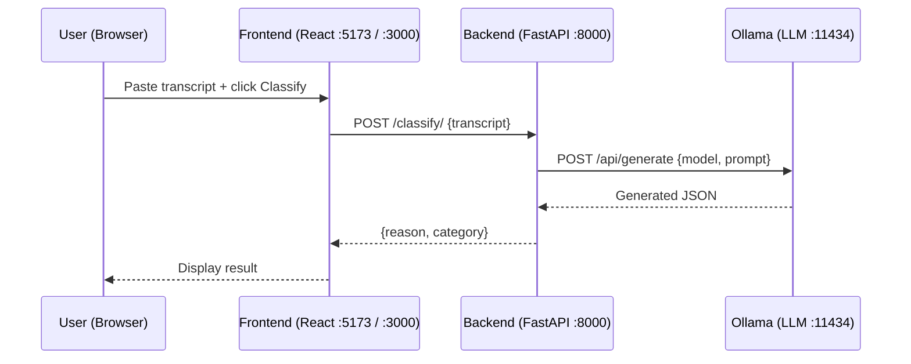

# Call-Classifier-AI

A full-stack AI application that classifies the intent of customer call transcripts using a locally-hosted large language model via [Ollama](https://ollama.com). Built with a **React + Vite** frontend and a **FastAPI** backend, fully containerised with Docker.

---

## What it does

Paste any call transcript into the UI and the system returns a structured classification:

| Field | Description |
|---|---|
| `reason` | A concise, human-readable summary of why the call was made |
| `category` | One of: `inquiry`, `advice_request`, `complaint`, `account_status`, `transaction`, `other` |

The LLM prompt is tuned for **investment, wealth, and retirement** domain calls but can be adapted to any industry by editing the prompt in [`call-classifier-backend/routers/llm.py`](call-classifier-backend/routers/llm.py).

---

## Problem Statement

Customer service teams handle a high volume of calls daily, each made for a different reason. Without a structured way to categorise these interactions, businesses lack the insight needed to:

- Understand the **distribution of call types** and identify the most common reasons customers reach out
- Pinpoint **operational bottlenecks** — e.g. which call types cause the longest handling times or resolution delays
- Identify **complaint patterns** and respond to them proactively
- Make **data-driven decisions** around staffing, training, and process improvement

Manual categorisation is time-consuming, inconsistent, and unscalable during high-demand periods.

---

## Solution

Call Classifier automates this process by routing each transcript through a locally-hosted LLM that returns a **structured, consistent classification** — a concise reason and a standardised category — in real time.

- No manual tagging or post-call data entry required
- Consistent output schema across all calls, regardless of transcript length or style
- Fully self-hosted: no data leaves your infrastructure

---

## Benefits

- **Reduced operational overhead** — teams no longer need to manually review and tag call logs
- **Faster trend detection** — real-time categorisation surfaces demand spikes and complaint surges as they happen
- **Actionable analytics** — structured data feeds directly into dashboards, reports, and downstream workflows
- **Adaptable to any domain** — swap the prompt to classify calls in any industry, not just financial services

---

## Future Scope

- **Embedding-based similarity matching** — use vector embeddings to cluster calls by semantic meaning, enabling more nuanced analysis beyond fixed categories
- **Cost reduction** — embeddings allow lighter-weight models or retrieval-augmented approaches to replace full LLM inference for common call patterns
- **Trend forecasting** — historical classification data can train predictive models to anticipate demand by call type
- **Agent integration** — pipe classifications directly into CRM or ticketing systems to trigger automated follow-up workflows

---

## Architecture



**Request flow:**

1. User pastes a transcript into the React UI and clicks **Classify Call**
2. The frontend sends `POST /classify/` with the raw transcript text
3. The FastAPI backend builds a structured prompt and forwards it to the Ollama HTTP API
4. Ollama runs the selected LLM locally and returns a JSON response
5. The backend parses the response and returns `reason` and `category`
6. The frontend displays the classification result

---

## Tech Stack

| Layer | Technology | Version |
|---|---|---|
| Frontend framework | [React](https://react.dev) | 19 |
| Frontend build tool | [Vite](https://vitejs.dev) | 5 |
| Frontend server (Docker) | [nginx](https://nginx.org) | Alpine |
| Backend framework | [FastAPI](https://fastapi.tiangolo.com) | 0.104.1 |
| Backend server | [Uvicorn](https://www.uvicorn.org) | 0.24.0 |
| Backend runtime | Python | 3.11+ |
| Python package manager | [uv](https://github.com/astral-sh/uv) | latest |
| Data validation | [Pydantic](https://docs.pydantic.dev) | v2 (2.5.0) |
| HTTP client | [HTTPX](https://www.python-httpx.org) | 0.26.0 |
| LLM runtime | [Ollama](https://ollama.com) | local |
| Containerisation | Docker | multi-stage builds |

---

## Tools & Libraries

| Tool | Role |
|---|---|
| **React 19** | Component-based UI library powering the single-page application |
| **Vite 5** | Frontend bundler with hot module replacement for fast development iteration |
| **nginx** | Serves the production React build inside Docker with SPA routing and gzip compression |
| **FastAPI** | Python web framework that auto-generates OpenAPI docs and validates request/response schemas |
| **Uvicorn** | ASGI server that runs FastAPI; `--reload` enables hot-reload during local development |
| **uv** | Fast Python package and project manager — replaces pip and venv |
| **Pydantic v2** | Enforces strict request/response schemas and serialises Python objects to JSON |
| **HTTPX** | HTTP client used to call the Ollama `/api/generate` endpoint from the backend |
| **Ollama** | Runs open-weight LLMs locally and exposes a simple REST API for inference |
| **Docker** | Multi-stage builds produce small, production-ready images for both services |

---

## Prerequisites

| Requirement | For | Install |
|---|---|---|
| [Docker](https://docs.docker.com/get-docker/) | Containerised run | [docs.docker.com](https://docs.docker.com/get-docker/) |
| Python ≥ 3.11 | Local backend run | [python.org](https://www.python.org/downloads/) |
| [uv](https://github.com/astral-sh/uv) | Local backend run | `curl -LsSf https://astral.sh/uv/install.sh \| sh` |
| Node.js ≥ 20 | Local frontend run | [nodejs.org](https://nodejs.org/) |
| [Ollama](https://ollama.com/download) | Both run modes | [ollama.com/download](https://ollama.com/download) |

---

## Project Structure

```
Call-Classifier-AI/
├── call-classifier-backend/
│   ├── main.py                    # FastAPI app — registers middleware and routers
│   ├── middleware.py              # CORS middleware configuration
│   ├── models.py                  # Pydantic request/response models
│   ├── pyproject.toml             # Python project config (managed by uv)
│   ├── Dockerfile                 # Multi-stage Docker build
│   ├── .env                       # Local environment variables (not committed)
│   ├── routers/
│   │   └── llm.py                 # POST /classify/ endpoint + Ollama integration
│   └── test/
│       └── test_transcript.md     # Sample transcript for manual testing
└── call-classifier-frontend/
    ├── src/
    │   ├── App.jsx                # Root UI component — handles state and API calls
    │   ├── App.css                # Component styles
    │   ├── main.jsx               # React entry point
    │   └── index.css              # Global styles, CSS variables, dark mode
    ├── public/                    # Static assets copied as-is to the build output
    ├── index.html                 # HTML shell — Vite injects the JS bundle here
    ├── vite.config.js             # Vite bundler configuration
    ├── nginx.conf                 # nginx config for Docker (SPA routing, gzip, caching)
    └── Dockerfile                 # Multi-stage Docker build
```

---

## How to Run

### Step 1 — Start Ollama and pull a model

```bash
ollama serve                        # starts Ollama on port 11434
ollama pull gpt-oss:120b-cloud      # pull the default model
```

Any instruction-following model works. See [Configuration](#configuration) to swap models.

---

### Option A — Docker

Build and run each service in its own container:

```bash
# Backend
cd call-classifier-backend
docker build -t call-classifier-backend .
docker run -p 8000:8000 \
  -e OLLAMA_API_URL=http://host.docker.internal:11434/api/generate \
  call-classifier-backend

# Frontend (new terminal)
cd call-classifier-frontend
docker build -t call-classifier-frontend .
docker run -p 3000:80 call-classifier-frontend
```

Open [http://localhost:3000](http://localhost:3000).

---

### Option B — Local development

**Backend:**

```bash
cd call-classifier-backend
uv sync                             # creates .venv and installs dependencies
ollama serve                        # in a separate terminal
uv run uvicorn main:app --reload    # starts on http://localhost:8000
```

**Frontend:**

```bash
cd call-classifier-frontend
npm install
npm run dev                         # starts on http://localhost:5173
```

---

## API Reference

Interactive docs (Swagger UI) are available at [http://localhost:8000/docs](http://localhost:8000/docs) when the backend is running.

### `POST /classify/`

Classifies a call transcript and returns a structured intent.

**Request body**

```json
{
  "transcript": "Hello, I'd like to check the current value of my pension pot."
}
```

**Response** `200 OK`

```json
{
  "reason": "Customer is requesting the current value of their pension account.",
  "category": "account_status"
}
```

**Category values**

| Value | Meaning |
|---|---|
| `inquiry` | General question or information request |
| `advice_request` | Customer seeking financial or product advice |
| `complaint` | Customer expressing dissatisfaction with a product or service |
| `account_status` | Checking balances, statements, or policy status |
| `transaction` | Requesting a financial transaction or change |
| `other` | Does not fit any of the above |

**Error response** `500 Internal Server Error`

```json
{
  "detail": "Failed to classify call"
}
```

---

## Configuration

The backend reads these environment variables. Set them in `.env` or pass them at runtime.

| Variable | Default | Description |
|---|---|---|
| `OLLAMA_API_URL` | `http://localhost:11434/api/generate` | Full URL of the Ollama generate endpoint |
| `OLLAMA_MODEL` | `gpt-oss:120b-cloud` | Ollama model tag to use for inference |

**Examples:**

```bash
# Local — override before starting the server
export OLLAMA_MODEL=llama3
uv run uvicorn main:app --reload

# Docker — pass as environment variables
docker run -p 8000:8000 \
  -e OLLAMA_API_URL=http://host.docker.internal:11434/api/generate \
  -e OLLAMA_MODEL=llama3 \
  call-classifier-backend
```

---

## License

[MIT](LICENSE)
